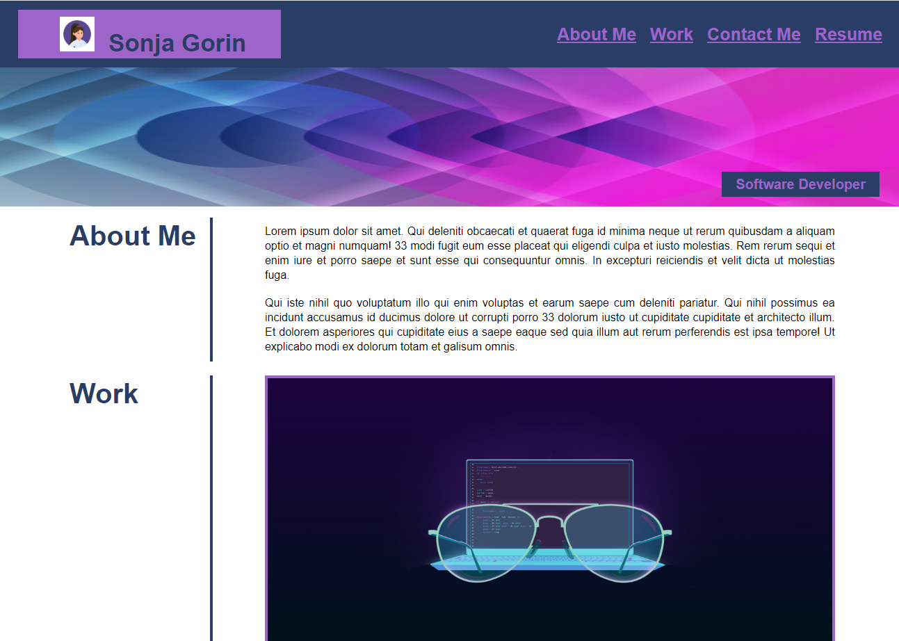
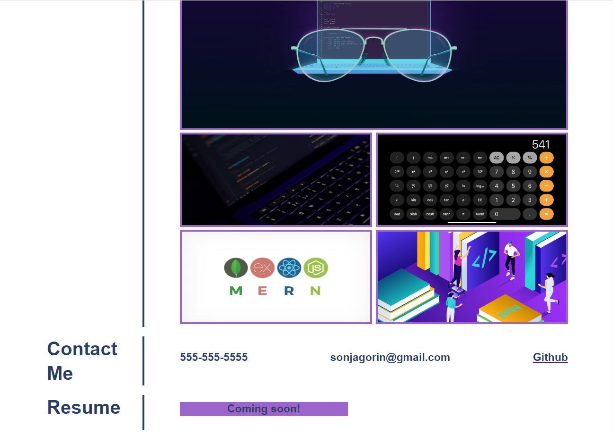

# Portfolio

## Description
A compilation of academic and professional materials.
This was the first challenge where I had to write the code from the beginning. It was hard, but exciting.

## Installation
N/A

## Usage
To view my Portfolio you can click on the link below.

[Portfolio - Sonja Gorin](http://sonjagorin.github.io/Portfolio)

Page preview:

## Credits
N/A

## License
Please refer to the LICENSE in the repo.
